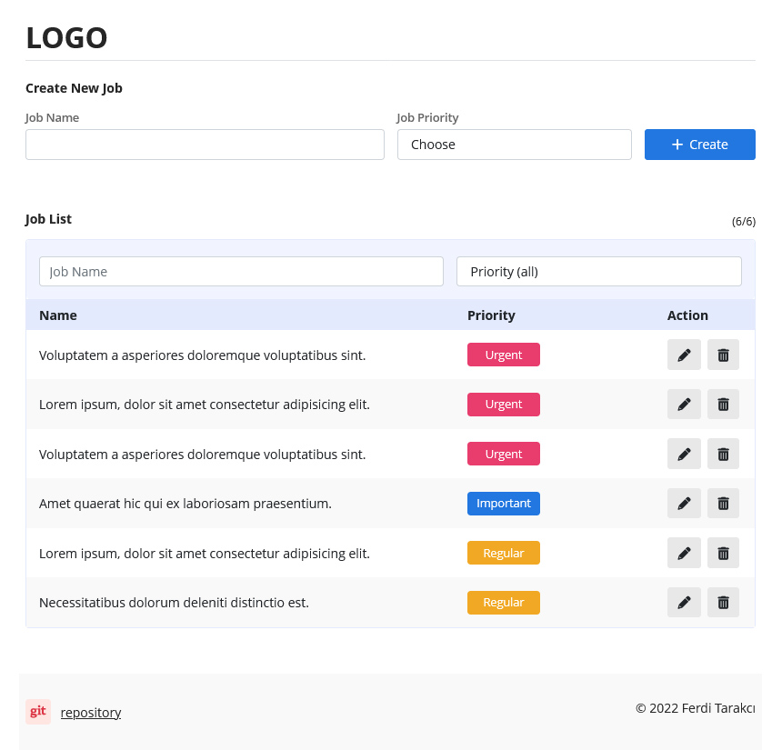
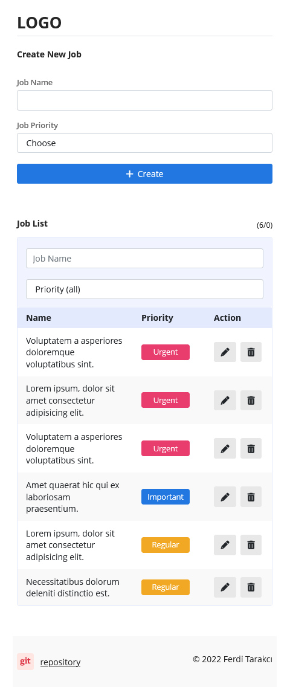

# Personal Job Tracking Application With React

## Application Description
This app is built using ReactJS. The application pulls the priority list by making a request to a simple API endpoint. Saved jobs are stored in localStorage.

## Uygulama Tanımı (TR)
Bu uygulama ReactJS kullanılarak oluşturulmuştur. Uygulama, basit bir API uç noktasına istekte bulunarak öncelik listesini çeker. Kaydedilen işler localStorage'da saklanır.

## Deployment
This project is automatically imported into the production environment with Vercel.

Bu proje Vercel ile otomatik olarak üretim ortamına aktarılır. (TR)
  

<a href="https://todo.ferditarakci.com.tr" target="_blank" title="Personal Job Tracking Application">https://todo.ferditarakci.com.tr</a>\
<a href="https://personal-job-tracking-app-with-react.vercel.app" target="_blank" title="Personal Job Tracking Application">https://personal-job-tracking-app-with-react.vercel.app</a>

 

------

 

## Available Scripts

In the project directory, you can run:

### `npm start`

Runs the app in the development mode.\
Open [http://localhost:3000](http://localhost:3000) to view it in your browser.

The page will reload when you make changes.\
You may also see any lint errors in the console.

### `npm test`

Launches the test runner in the interactive watch mode.\
See the section about [running tests](https://facebook.github.io/create-react-app/docs/running-tests) for more information.

### `npm run build`

Builds the app for production to the `build` folder.\
It correctly bundles React in production mode and optimizes the build for the best performance.

The build is minified and the filenames include the hashes.\
Your app is ready to be deployed!

See the section about [deployment](https://facebook.github.io/create-react-app/docs/deployment) for more information.

 

------

 

## Desktop Screenshot

 
 

## Mobile Screenshot

